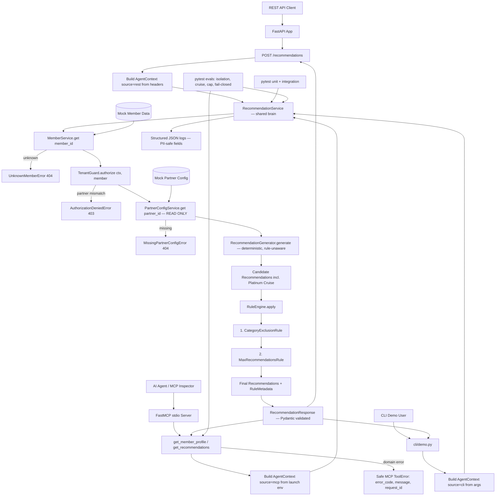

# Architecture — Agentic Travel Recommendations Service (Lean MVP)

Deterministic backend is the source of truth. Three thin front doors (REST, MCP
stdio, CLI) share ONE orchestration brain. The LLM/AI agent is the MCP *client*,
never inside the service — it can request tools but can never enforce partner
rules, authorize access, or invent member facts.

## Key properties

- **One shared brain.** REST, MCP, and CLI all call `RecommendationService`. MCP
  tools are ~10 lines each and contain no business logic.
- **Guard on every member access.** Both `get_recommendations` and
  `get_member_profile` run `MemberService.get` → `TenantGuard.authorize` before
  returning anything. No front door reaches `MemberService` without the guard.
- **Fixed rule order:** category exclusions first, then caps. Proven by a named
  test (`test_exclusion_runs_before_cap`).
- **Fail closed:** unknown member, missing config, tenant mismatch, or schema
  failure → safe structured error. No stack traces or raw PII anywhere.
- **Deterministic:** no LLM, no clock, no randomness in the recommendation path.
  No API key needed to run, test, or demo.
- **Observability is AWS/Azure-native** (structured JSON logs; production framing
  = CloudWatch/App Insights, X-Ray/OpenTelemetry). No third-party platform.

See `docs/superpowers/2026-07-08-agentic-travel-recs-design.md` for the full
design and `docs/superpowers/plans/2026-07-08-agentic-travel-recs.md` for the
implementation plan.
